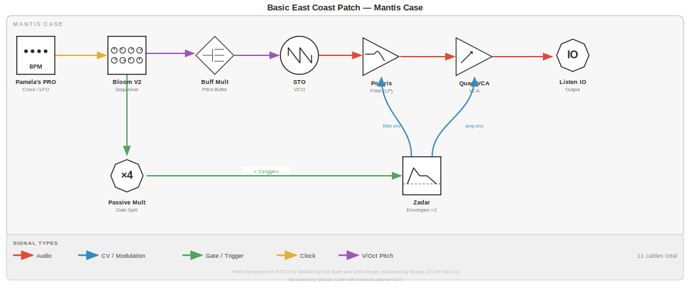

# Basic East Coast Patch

**Category**: sequences
**Complexity**: Simple
**Voices**: 1

## Concept

Classic subtractive synthesis: Bloom V2 sequences pitch and gates, STO generates a sawtooth-like tone, Polaris shapes the timbre with a filter envelope from Zadar, and the amplitude is sculpted by a second Zadar envelope through Quad VCA. Pamela's PRO Workout drives everything as master clock. A good starting point — patch it in 11 cables and you're making music.

## Signal Flow



```
PAMELA ──clock──▶ BLOOM V2 ──pitch──▶ BUFF MULT ──V/Oct──▶ STO ──audio──▶ POLARIS ──audio──▶ QUAD VCA ──▶ LISTEN IO
                     │                                               ▲             ▲
                   gate│                                       filter env│     amp env│
                       ▼                                                 │             │
                 PASSIVE MULT ──────────────── ×2 triggers ────────▶ ZADAR ch1+ch2
```

## Module Settings

### Pamela's PRO Workout
- Out 1: Clock, 120 BPM, ÷1 (quarter notes to Bloom)
- All other outputs: unused in this patch

### Bloom V2
- Length: 8 steps
- Branches: 1 (fully linear for predictable sequence)
- Mutation: 0 (no randomisation — dial in later)
- Scale: set a pentatonic or minor scale for easy musicality

### STO
- Frequency: set to a comfortable bass-mid range (C2–C3)
- FM attenuator: fully CCW (no FM modulation in this patch)
- Sync: not patched

### Polaris
- Mode: LP (Lowpass)
- Cutoff: ~35% — closed enough that the envelope sweep is audible
- Resonance: ~20% — a gentle peak, no self-oscillation
- FM attenuator: ~50% — lets Zadar ch1 open the filter meaningfully

### Zadar Ch1 (Filter Envelope)
- Shape: standard AD/ADSR shape (or a sharp attack with medium decay)
- Attack: fast (~5ms)
- Decay/Release: medium (~300ms)
- Mode: triggered (not cycling)

### Zadar Ch2 (Amplitude Envelope)
- Shape: standard AD
- Attack: fast (~5ms)
- Decay: slightly longer than ch1 (~500ms) so amplitude outlasts the filter snap
- Mode: triggered (not cycling)

### Quad VCA
- Ch1 response: exponential (more musical for amplitude)
- Ch1 level knob: ~75%
- Output: use Mix Out into Listen IO

### Listen IO
- Level: set to taste

## Modulation Routing

| Source | Destination | Signal | Notes |
|--------|-------------|--------|-------|
| Zadar Ch1 | Polaris FM In | CV | Filter cutoff sweep — timed with each note |
| Zadar Ch2 | Quad VCA Ch1 CV | CV | Amplitude envelope — controls note duration |

## Patch Cable Table

### Clock / Trigger

| Cable | Output Module | Output Jack | Input Module | Input Jack | Signal Type | Notes |
|-------|--------------|------------|-------------|-----------|-------------|-------|
| 1 | Pamela's PRO Workout | Out 1 | Bloom V2 | Clock In | Clock | Master clock — quarter notes |
| 2 | Bloom V2 | Gate Out | Passive Multiple | In | Gate | Gate to envelope triggers |
| 3 | Passive Multiple | Out 1 | Zadar | Trigger 1 | Gate | Filter envelope trigger |
| 4 | Passive Multiple | Out 2 | Zadar | Trigger 2 | Gate | Amplitude envelope trigger |

### Pitch CV

| Cable | Output Module | Output Jack | Input Module | Input Jack | Signal Type | Notes |
|-------|--------------|------------|-------------|-----------|-------------|-------|
| 5 | Bloom V2 | CV Out | Buff Mult with Attenuators | In | CV (1V/Oct) | Buffered for pitch accuracy |
| 6 | Buff Mult with Attenuators | Out 1 | STO | V/Oct | CV (1V/Oct) | Pitch to oscillator |

### Envelope / Dynamics

| Cable | Output Module | Output Jack | Input Module | Input Jack | Signal Type | Notes |
|-------|--------------|------------|-------------|-----------|-------------|-------|
| 7 | Zadar | Ch1 Out | Polaris | FM In | CV | Filter cutoff envelope |
| 8 | Zadar | Ch2 Out | Quad VCA | Ch1 CV | CV | Amplitude envelope |

### Audio Signal Path

| Cable | Output Module | Output Jack | Input Module | Input Jack | Signal Type | Notes |
|-------|--------------|------------|-------------|-----------|-------------|-------|
| 9 | STO | Output (Triangle) | Polaris | Audio In | Audio | Main oscillator voice |
| 10 | Polaris | LP Out | Quad VCA | Ch1 In | Audio | Filtered audio to VCA |
| 11 | Quad VCA | Mix Out | Listen IO | L In | Audio | Final output to monitors |

### Cable Summary

| Location | Cable Count |
|----------|------------|
| Mantis | 11 |
| **Total** | **11** |

## Performance Tips

- **Bloom mutation**: Slowly turn up Mutation for evolving melodic variation — the fractal algorithm keeps things musically coherent.
- **Filter cutoff**: Manually sweep Polaris cutoff while the patch plays — it responds expressively and is the main performance control.
- **Resonance**: Increasing Polaris resonance past 50% adds significant character. Push it toward self-oscillation for effect.
- **Zadar shapes**: Zadar has dozens of envelope shapes beyond AD/ADSR. Try convex/concave decay shapes on ch1 for different filter characters.
- **Tempo**: Change Pamela's BPM to shift from meditative to driving. Try slowing to 60 BPM with longer decay times for a more deliberate feel.
- **Expanding the patch**: Add a second voice with Pleiades (Plaits engines) → Mega Milton mixer; use remaining Zadar channels for it.

---
*Generated by Claude Code with eurorack-patcher skill*
*Date: 2026-04-04*
